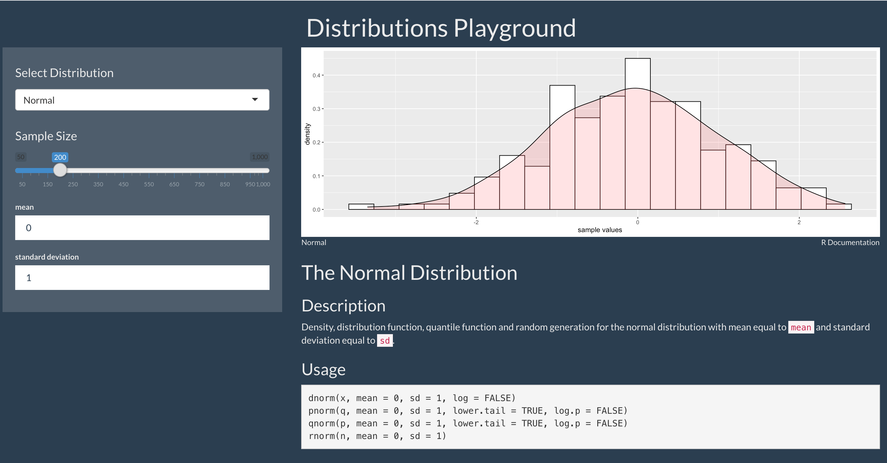

## Distribution Playground

Shiny App to play around with various distributions. Give sample size and parameter values to review the shape of the distribution



To build image make sure that you are in the project directory and execute the following:

```
 docker build -t dummy_image_name .
```

After image is built to run execute the following:

```
docker run -p 80:80 dummy_image_name
```


Access the app on: 

```
http://localhost 
```
